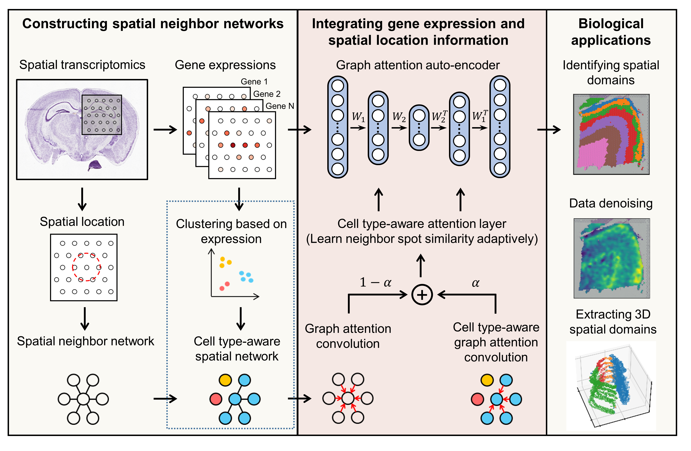

# 整理到的对空间转录组进行聚类分析的算法

|    | model | journal | paper | status | tutorial | note  
| -- | ----- | ------- | ----- | ------ | -------- | ---- 
|1|Leiden|Scientific Reports|[Leiden](https://doi.org/10.1038/s41598-019-41695-z)|NULL|[tutorial]()|  
|2|STAGATE|Nature Communications|[STAGATE](https://doi.org/10.1038/s41467-022-29439-6)|*|[tutorial](./STAGATE_pyG/train.ipynb)|只有tf实现中可以使用alpha，torch实现中没有这个功能  
|3|CCST|Nature Computational Science|[CCST](https://doi.org/10.1038/s43588-022-00266-5)|NULL|[tutorial]()|  
|4|SpaGCN|Nature Methods|[SpaGCN](https://doi.org/10.1038/s41592-021-01255-8)|NULL|[tutorial]()|  
|5|SEDR|-|[SEDR](https://doi.org/10.21203/rs.3.rs-665505/v1)|NULL|[tutorial]()|  
|6|BayesSpace|Nature Biotechnology|[BayesSpace](https://doi.org/10.1038/s41587-021-00935-2)|NULL|[tutorial]()|  
|7|stLearn|bioRxiv|[stLearn](https://doi.org/10.1101/2020.05.31.125658)|NULL|[tutorial]()|  
|8|Giotto|BMC Genome Biology|[Giotto](https://doi.org/10.1186/s13059-021-02286-2)|NULL|[tutorial]()|  
|9|TransformerST|bioRxiv|[TransformerST](https://doi.org/10.1101/2022.08.11.503261)|NULL|[tutorial]()|  
|10|FICT|Bioinformatics|[FICT](https://doi.org/10.1093/bioinformatics/btab704)|NULL|[tutorial]()|  
|11|scGNN|Nature Communications|[scGNN](https://doi.org/10.1038/s41467-021-22197-x)|NULL|[tutorial]()|  

## Leiden

## STAGATE
  
使用类似于自编码器的结构，在聚合邻边信息时引入attention  

- 生成图:  
使用KNN或是给定半径  
在生成图时可以先进行一次pre-cluster，切断聚类中不同类之间的边  

- GNN:  
如结构图中所示，使用一个类似自编码器的结构  
在编码的过程中:  
对于每次聚合 $h^{(k)}_i = \sigma(\sum_{j\in S_i} att^{(k)}_{ij} (W_kh^{(k-1)}_j))$  
最后一层全连接 $h^{(k)}_i = \sigma(W_kh^{(k-1)}_j)$  
解码过程和编码过程类似，不同的是解码时使用的att值和编码时相同，解码时使用的全连接层是编码时使用的全连接层的转置   
attention机制:  
训练邻边和自身的向量$v_s$和$v_r$  
$$
e^{(k)}_{ij} = \sigma(v^{(k)^T}_s (W_kh^{k-1}_i) + v^{(k)^T}_r (W_kh^{k-1}_j)), \\
att^{(k)}_{ij} = \frac{exp(e^{(k)}_{ij})}{\sum_{i \in N(i)}e^{(k)}_{ij}},
$$
如果使用到了Construction of cell type-aware SNN，则只需要按设定好的$\alpha$将两个attention相加即可
$$
att_{ij} = (1 - \alpha)att^{spatial}_{ij} + \alpha att^{aware}_{ij}
$$

- loss:  
主要思想是经过编码/解码后得到的值应该和原值类似，所以loss函数设置为前后两向量的距离  
$\sum^N_{i=1} || x_i - \hat{h}^0_i ||_2$

## CCST

## SpaGCN

## SEDR

## BayesSpace

## stLearn

## Giotto

## TransformerST

## FICT
  

## scGNN

# 目前整理到可以使用的数据集

## 